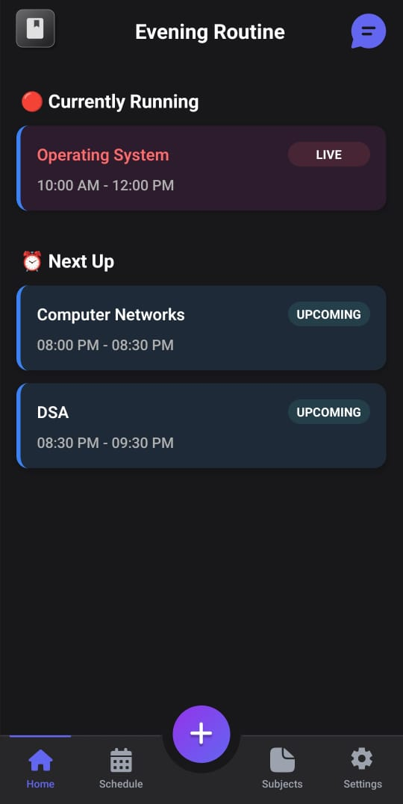
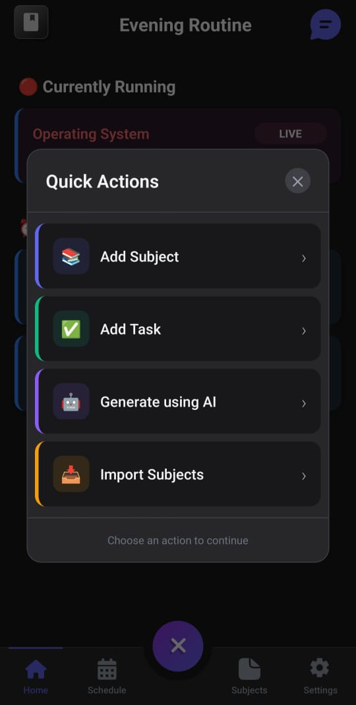
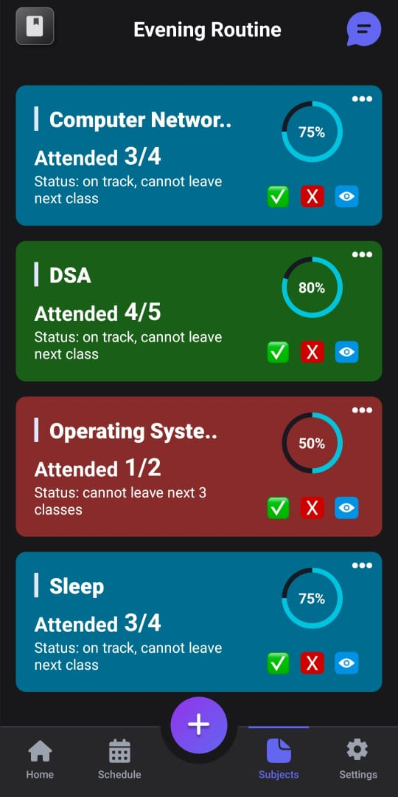
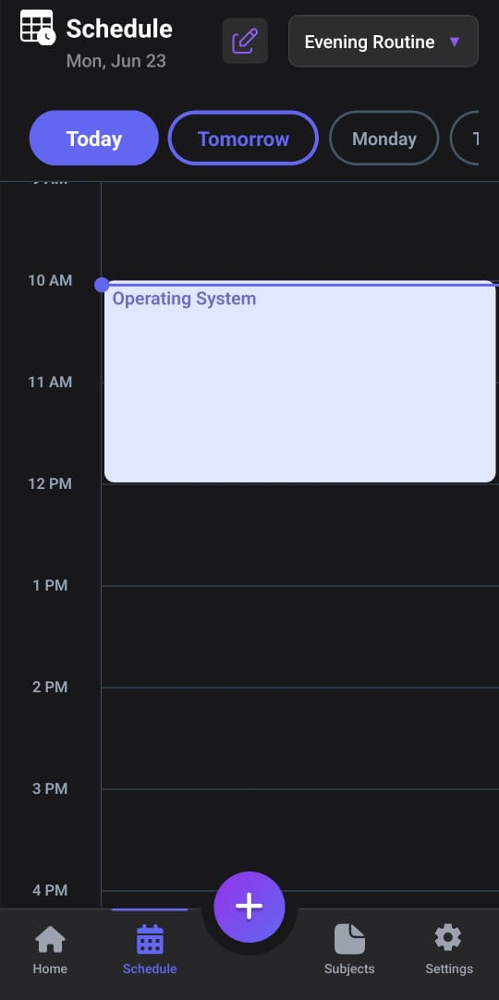
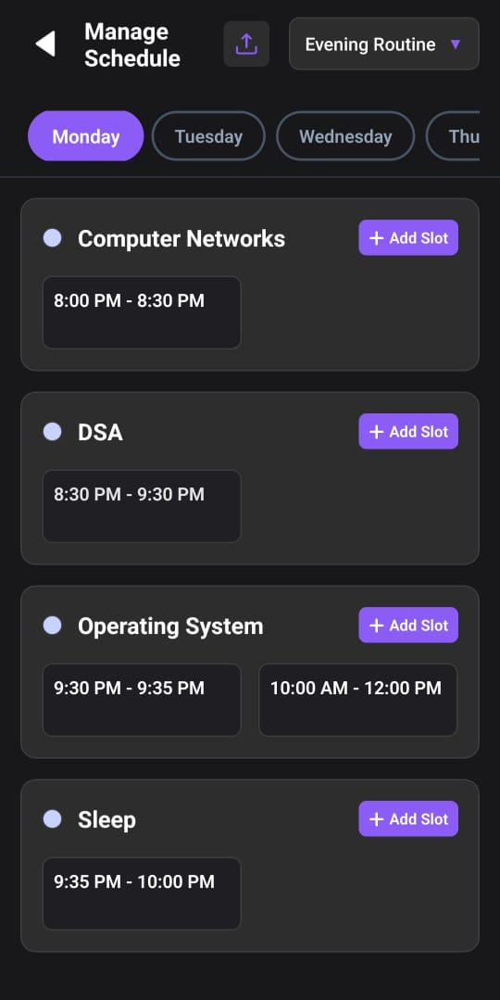
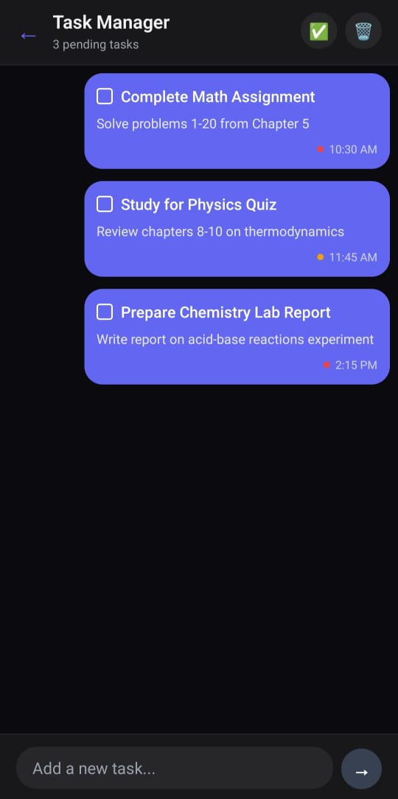

# 🌟 ScheduleX: Attendance & Time Table Scheduling App  

  

  
  
  

A cross-platform **React Native** application designed to help you track attendance and manage schedules with ease.  

---

## ✨ Features  

- 📊 **Track Attendance**: Easily mark & monitor attendance for different classes or events.  
- 🤖 **AI Scheduling**: Instantly generate an optimized timetable based on your inputs or CSV file.  
- 🔁 **Timetable Sharing**: Share your timetable with others — they can import it directly without manually entering anything.  
- 📋 **Task Chat**: Add, manage, and mark tasks as complete — like a to-do list with built-in accountability.  
- 📆 **Timetable Management**: Create, edit, and organize your event schedules effortlessly.  
- 🔔 **Reminders & Alerts**: Set alerts to remind you of low attendance.  
- ☁️ **Cloud Sync**: Sync data across multiple devices.  

---

## 📱 App Screenshots  

  
Click to view screenshots

|  |  |  |
| --------------------------------------------- | --------------------------------------------- | --------------------------------------------- |
|  |  |  |

---

## 🎥 App Demo Videos  

  
Click to view demo videos

| **Timetable Saving Demo** | **Attendance Tracker Demo** |
|------------------------------|------------------------------|
|  |  |

---

## 📜 Assignments Note  

| Level | Time to Complete | Note |
|-------|------------------|------|
| 🟢 **Level 1** | 5 Days  | Complete within 5 days or the issue may be reassigned. |
| 🟡 **Level 2** | 10 Days | Complete within 10 days or the issue may be reassigned. |
| 🔴 **Level 3** | 20 Days | Complete within 20 days or the issue may be reassigned. |

---

## 🛠 Tech Stack  

- **React Native** - Frontend framework  
- **Redux** - State management  
- **AsyncStorage / Firebase** - Data persistence  
- **React Navigation** - Seamless app navigation  

---

## 🤝 Contributing  

We’d love your help in improving this project!  
📋 **[Contributing Guidelines](.github/CONTRIBUTING.md)**  

## 📜 Code of Conduct  

🤝 **[Code of Conduct](.github/CODE_OF_CONDUCT.md)**  

## 🚀 Quick Start  

📖 **[Setup & Installation Guide](.github/SETUP.md)**  

---

## ✨ Maintainers (GSSoC'25)  

#### Project Admin
- **Anirudh Sharma** — [GitHub](https://github.com/anisharma07) — @anisharma07 

#### Mentors
- **Irtesaam** — [GitHub](https://github.com/Irtesaam) — @Irtesaam  
- **Nikhil Balamurugan** — [GitHub](https://github.com/Nikhil210206) — @Nikhil210206  

## 🏆 Contributors  

Thanks to these amazing people for their contributions ❤️  

  

---

## 📩 Need Help?  

- Tag PA or mentors in Issues/PRs for a faster response  
- Join our Discord: [https://discord.gg/s8MbexBPjq](https://discord.gg/s8MbexBPjq)  

---

  ✨ <strong>Vibe • Coding • Imaginations</strong> ✨  

  <a href="#top" style="font-size: 16px; padding: 8px 16px; border: 1px solid #ccc; border-radius: 6px; text-decoration: none;">
    ⬆️ Back to Top
  </a>

