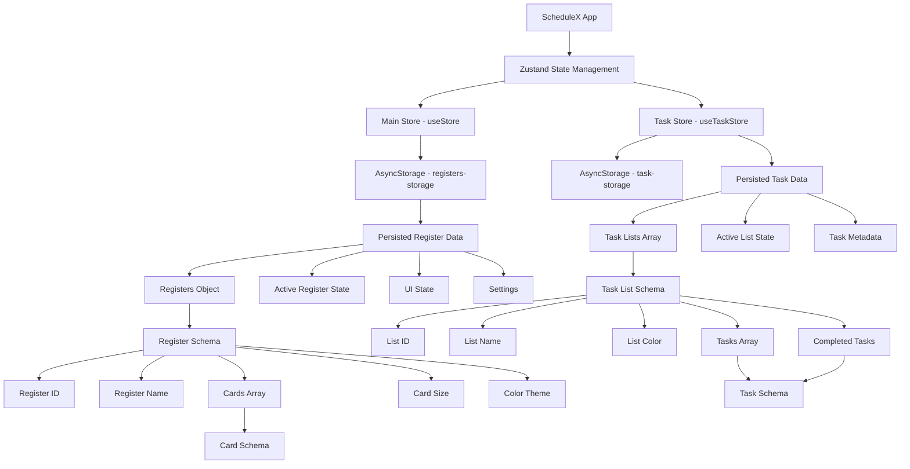
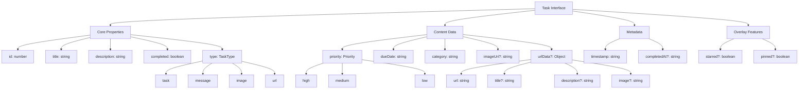
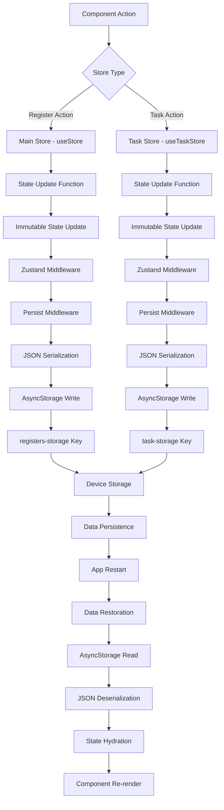
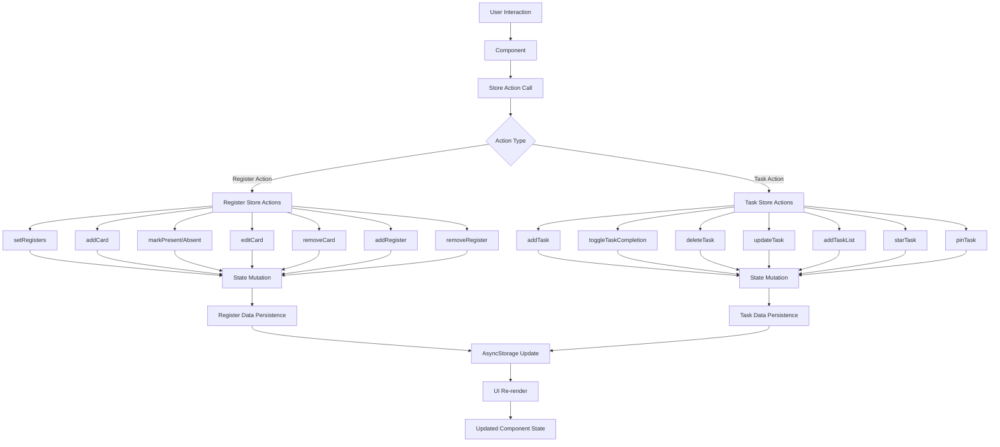
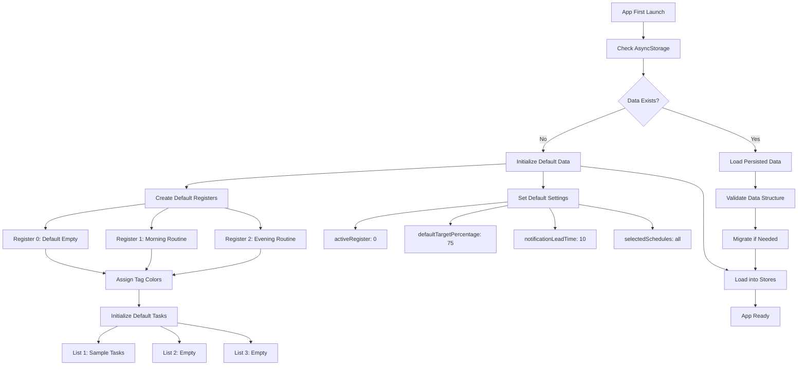

# ScheduleX Data Storage Architecture

## Data Storage Architecture Overview



## Card Storage Schema

```mermaid
graph TD
    A[Card Interface] --> B[Core Properties]
    A --> C[Attendance Data]
    A --> D[Schedule Data]
    A --> E[Metadata]
    
    B --> B1[id: number]
    B --> B2[title: string]
    B --> B3[target_percentage: number]
    B --> B4[tagColor: string]
    
    C --> C1[present: number]
    C --> C2[total: number]
    C --> C3[markedAt: Array]
    
    C3 --> C3a[Marking Schema]
    C3a --> C3a1[id: number]
    C3a --> C3a2[date: string]
    C3a --> C3a3[isPresent: boolean]
    C3a --> C3a4[timeSlot?: string]
    
    D --> D1[days: Object]
    D1 --> D1a[mon: string[]]
    D1 --> D1b[tue: string[]]
    D1 --> D1c[wed: string[]]
    D1 --> D1d[thu: string[]]
    D1 --> D1e[fri: string[]]
    D1 --> D1f[sat: string[]]
    D1 --> D1g[sun: string[]]
    
    E --> E1[hasLimit: boolean]
    E --> E2[limit: number]
    E --> E3[limitType: string]
```

## Task Storage Schema



## State Management Flow



## Data Flow Architecture



## Default Data Initialization


