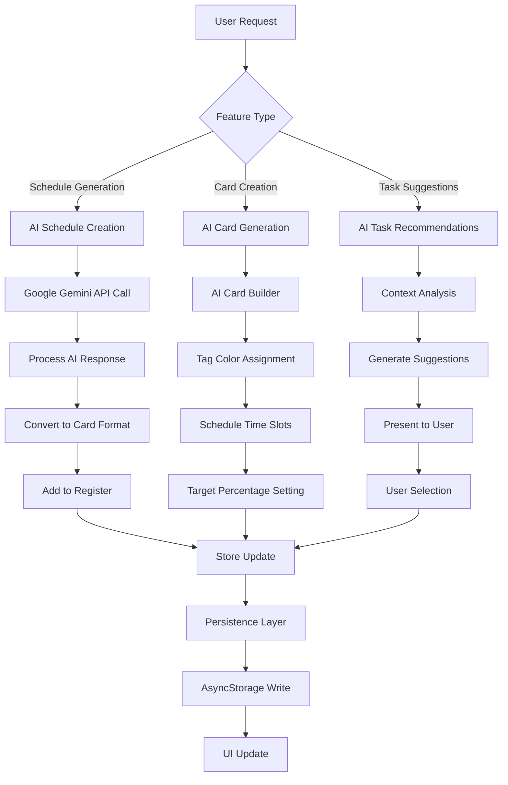
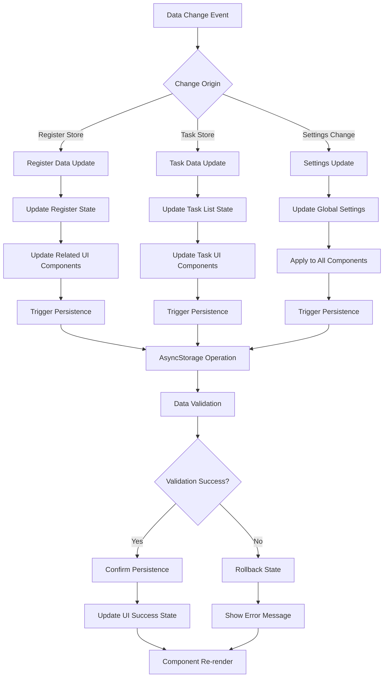
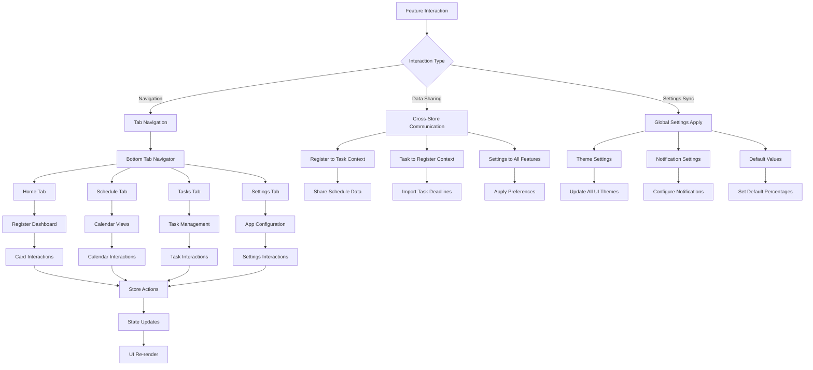

# ScheduleX Feature Integration Flow

## Register and Task Integration

```mermaid
graph TD
    A[ScheduleX Main App] --> B[Register System]
    A --> C[Task Chat System]
    A --> D[Shared Features]
    
    B --> B1[Multiple Registers]
    B --> B2[Card-based Attendance]
    B --> B3[Schedule Management]
    
    C --> C1[Multiple Task Lists]
    C --> C2[Rich Task Types]
    C --> C3[Task Interactions]
    
    D --> D1[Navigation System]
    D --> D2[Settings & Preferences]
    D --> D3[Data Export/Import]
    D --> D4[AI Integration]
    
    B1 --> E[Register Selection]
    E --> E1[Single Register View]
    E --> E2[Multi-Register View]
    E --> E3[Global Register View]
    
    B2 --> F[Card Operations]
    F --> F1[Quick Mark Present/Absent]
    F --> F2[Detailed Attendance History]
    F --> F3[Progress Analytics]
    
    C1 --> G[Task List Management]
    G --> G1[Create/Delete Lists]
    G --> G2[Rename Lists]
    G --> G3[Color Coding]
    
    C2 --> H[Task Content Types]
    H --> H1[Text Tasks]
    H --> H2[Image Tasks]
    H --> H3[URL Tasks with Preview]
    H --> H4[Message Tasks]
    
    C3 --> I[Advanced Task Features]
    I --> I1[Star/Pin Tasks]
    I --> I2[Forward Between Lists]
    I --> I3[Reply to Tasks]
    I --> I4[Task Completion Tracking]
    
    D4 --> J[Google Gemini AI]
    J --> J1[Generate Schedules]
    J --> J2[Create AI Cards]
    J --> J3[Smart Suggestions]
    
    E2 --> K[Aggregated View]
    E3 --> K
    K --> K1[Combined Statistics]
    K --> K2[Cross-Register Analytics]
    
    F3 --> L[Progress Tracking]
    I4 --> L
    L --> L1[Attendance Percentages]
    L --> L2[Task Completion Rates]
    L --> L3[Streak Monitoring]
    
    D3 --> M[Data Management]
    M --> M1[CSV Export]
    M --> M2[CSV Import]
    M --> M3[Data Backup]
    M --> M4[Data Restore]
```

## AI and Automation Flow

```mermaid
graph TD
    A[User Request] --> B{Feature Type}
    
    B -->|Schedule Generation| C[AI Schedule Creation]
    B -->|Card Creation| D[AI Card Generation]
    B -->|Task Suggestions| E[AI Task Recommendations]
    
    C --> C1[Google Gemini API Call]
    C1 --> C2[Process AI Response]
    C2 --> C3[Convert to Card Format]
    C3 --> C4[Add to Register]
    
    D --> D1[AI Card Builder]
    D1 --> D2[Tag Color Assignment]
    D2 --> D3[Schedule Time Slots]
    D3 --> D4[Target Percentage Setting]
    
    E --> E1[Context Analysis]
    E1 --> E2[Generate Suggestions]
    E2 --> E3[Present to User]
    E3 --> E4[User Selection]
    
    C4 --> F[Store Update]
    D4 --> F
    E4 --> F
    
    F --> G[Persistence Layer]
    G --> H[AsyncStorage Write]
    H --> I[UI Update]
```

## Data Synchronization Flow

```mermaid
graph TD
    A[Data Change Event] --> B{Change Origin}
    
    B -->|Register Store| C[Register Data Update]
    B -->|Task Store| D[Task Data Update]
    B -->|Settings Change| E[Settings Update]
    
    C --> C1[Update Register State]
    C1 --> C2[Update Related UI Components]
    C2 --> C3[Trigger Persistence]
    
    D --> D1[Update Task List State]
    D1 --> D2[Update Task UI Components]
    D2 --> D3[Trigger Persistence]
    
    E --> E1[Update Global Settings]
    E1 --> E2[Apply to All Components]
    E2 --> E3[Trigger Persistence]
    
    C3 --> F[AsyncStorage Operation]
    D3 --> F
    E3 --> F
    
    F --> G[Data Validation]
    G --> H{Validation Success?}
    
    H -->|Yes| I[Confirm Persistence]
    H -->|No| J[Rollback State]
    
    I --> K[Update UI Success State]
    J --> L[Show Error Message]
    
    K --> M[Component Re-render]
    L --> M
```

## Cross-Feature Communication

```mermaid
graph TD
    A[Feature Interaction] --> B{Interaction Type}
    
    B -->|Navigation| C[Tab Navigation]
    B -->|Data Sharing| D[Cross-Store Communication]
    B -->|Settings Sync| E[Global Settings Apply]
    
    C --> C1[Bottom Tab Navigator]
    C1 --> C2[Home Tab]
    C1 --> C3[Schedule Tab]
    C1 --> C4[Tasks Tab]
    C1 --> C5[Settings Tab]
    
    C2 --> F[Register Dashboard]
    C3 --> G[Calendar Views]
    C4 --> H[Task Management]
    C5 --> I[App Configuration]
    
    D --> D1[Register to Task Context]
    D --> D2[Task to Register Context]
    D --> D3[Settings to All Features]
    
    D1 --> J[Share Schedule Data]
    D2 --> K[Import Task Deadlines]
    D3 --> L[Apply Preferences]
    
    E --> E1[Theme Settings]
    E --> E2[Notification Settings]
    E --> E3[Default Values]
    
    E1 --> M[Update All UI Themes]
    E2 --> N[Configure Notifications]
    E3 --> O[Set Default Percentages]
    
    F --> P[Card Interactions]
    G --> Q[Calendar Interactions]
    H --> R[Task Interactions]
    I --> S[Settings Interactions]
    
    P --> T[Store Actions]
    Q --> T
    R --> T
    S --> T
    
    T --> U[State Updates]
    U --> V[UI Re-render]
```
