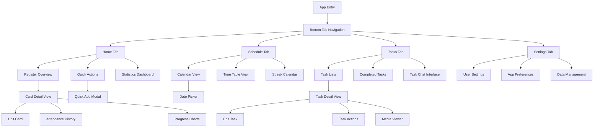
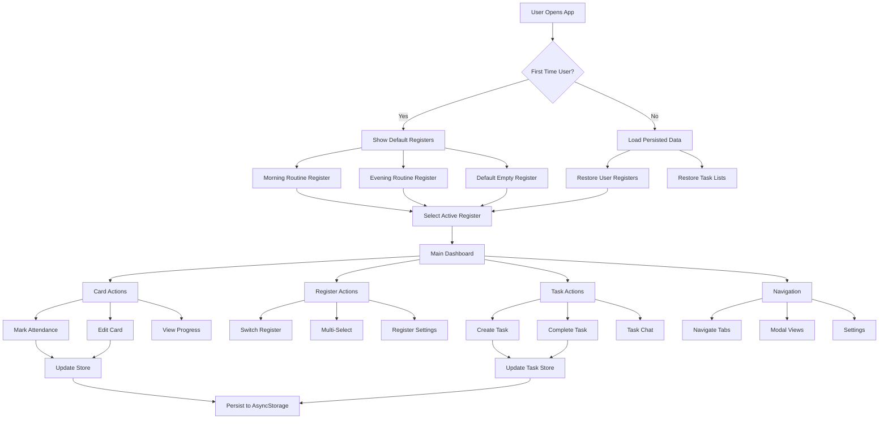

# ScheduleX App Frontend Features Flow Chart

## App Frontend Features Overview

```mermaid
graph TD
    A[ScheduleX App] --> B[Schedule Management]
    A --> C[Task Chat System]
    A --> D[AI Integration]
    A --> E[Data Export/Import]
    
    B --> B1[Register Management]
    B --> B2[Card Management]
    B --> B3[Attendance Tracking]
    B --> B4[Schedule Visualization]
    
    B1 --> B1a[Create Register]
    B1 --> B1b[Rename Register]
    B1 --> B1c[Delete Register]
    B1 --> B1d[Set Register Color]
    B1 --> B1e[Multiple Register Selection]
    
    B2 --> B2a[Add Card]
    B2 --> B2b[Edit Card]
    B2 --> B2c[Remove Card]
    B2 --> B2d[Set Card Size]
    B2 --> B2e[Tag Colors]
    B2 --> B2f[Time Slots]
    
    B3 --> B3a[Mark Present]
    B3 --> B3b[Mark Absent]
    B3 --> B3c[Undo Changes]
    B3 --> B3d[Remove Marking]
    B3 --> B3e[Date-specific Marking]
    B3 --> B3f[Target Percentage]
    
    B4 --> B4a[Calendar View]
    B4 --> B4b[Progress Tracking]
    B4 --> B4c[Statistics]
    B4 --> B4d[Streak Calendar]
    
    C --> C1[Task Lists]
    C --> C2[Task Management]
    C --> C3[Media Support]
    C --> C4[Task Interaction]
    
    C1 --> C1a[Create List]
    C1 --> C1b[Delete List]
    C1 --> C1c[Rename List]
    C1 --> C1d[Set List Color]
    
    C2 --> C2a[Add Task]
    C2 --> C2b[Complete Task]
    C2 --> C2c[Delete Task]
    C2 --> C2d[Update Task]
    C2 --> C2e[Priority Levels]
    C2 --> C2f[Due Dates]
    C2 --> C2g[Categories]
    
    C3 --> C3a[Image Tasks]
    C3 --> C3b[URL Tasks]
    C3 --> C3c[Link Preview]
    
    C4 --> C4a[Star Task]
    C4 --> C4b[Pin Task]
    C4 --> C4c[Forward Task]
    C4 --> C4d[Reply to Task]
    
    D --> D1[Google Gemini AI]
    D --> D2[Schedule Generation]
    D --> D3[AI Cards]
    
    E --> E1[CSV Export]
    E --> E2[CSV Import]
    E --> E3[Data Sharing]
```

## Navigation Structure

```mermaid
graph TD
    A[App Entry] --> B[Bottom Tab Navigation]
    
    B --> C[Home Tab]
    B --> D[Schedule Tab]
    B --> E[Tasks Tab]
    B --> F[Settings Tab]
    
    C --> C1[Register Overview]
    C --> C2[Quick Actions]
    C --> C3[Statistics Dashboard]
    
    D --> D1[Calendar View]
    D --> D2[Time Table View]
    D --> D3[Streak Calendar]
    
    E --> E1[Task Lists]
    E --> E2[Completed Tasks]
    E --> E3[Task Chat Interface]
    
    F --> F1[User Settings]
    F --> F2[App Preferences]
    F --> F3[Data Management]
    
    C1 --> G[Card Detail View]
    C2 --> H[Quick Add Modal]
    D1 --> I[Date Picker]
    E1 --> J[Task Detail View]
    
    G --> G1[Edit Card]
    G --> G2[Attendance History]
    G --> G3[Progress Charts]
    
    J --> J1[Edit Task]
    J --> J2[Task Actions]
    J --> J3[Media Viewer]
```

## User Interaction Flow

```mermaid
graph TD
    A[User Opens App] --> B{First Time User?}
    
    B -->|Yes| C[Show Default Registers]
    B -->|No| D[Load Persisted Data]
    
    C --> E[Morning Routine Register]
    C --> F[Evening Routine Register]
    C --> G[Default Empty Register]
    
    D --> H[Restore User Registers]
    D --> I[Restore Task Lists]
    
    E --> J[Select Active Register]
    F --> J
    G --> J
    H --> J
    
    J --> K[Main Dashboard]
    
    K --> L[Card Actions]
    K --> M[Register Actions]
    K --> N[Task Actions]
    K --> O[Navigation]
    
    L --> L1[Mark Attendance]
    L --> L2[Edit Card]
    L --> L3[View Progress]
    
    M --> M1[Switch Register]
    M --> M2[Multi-Select]
    M --> M3[Register Settings]
    
    N --> N1[Create Task]
    N --> N2[Complete Task]
    N --> N3[Task Chat]
    
    O --> O1[Navigate Tabs]
    O --> O2[Modal Views]
    O --> O3[Settings]
    
    L1 --> P[Update Store]
    L2 --> P
    N1 --> Q[Update Task Store]
    N2 --> Q
    
    P --> R[Persist to AsyncStorage]
    Q --> R
```
